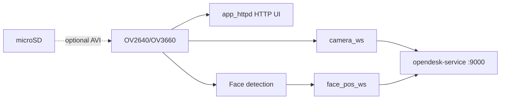

# Deskbot Camera

[中文](README_zh.md) | English · Repo root: [README.md](../README.md)

**Seeed XIAO ESP32S3 Sense** camera firmware: local HTTP preview, JPEG + face landmarks uplink over WebSocket, optional SD AVI recording. Works alongside [deskbot-rom](../deskbot-rom/README.md).

## Configure & flash

WiFi / server / device_id live in repo-root **`deskbot.local.env`** (`flash_camera.sh` can prompt for WiFi):

```bash
cd deskbot-camera
./flash_camera.sh all
```

| Script | Action |
|--------|--------|
| `./flash_camera.sh build` | Compile only |
| `./flash_camera.sh upload [port]` | Flash (often `/dev/ttyACM0`) |
| `./flash_camera.sh log [port]` | Serial monitor (115200) |
| `./flash_camera.sh all [port]` | Upload + monitor |

**After boot:** serial prints device IP and `device_id=deskbot_<mac>` → open `http://<IP>/` for preview.

Without `DESKBOT_WS_HOST`, HTTP preview and on-device face detection still work; WebSocket uplink is disabled.

**Device ID:** auto `deskbot_<mac>` from board MAC. Same board as main ROM shares the same ID; no build-time config.

## Architecture



| Component | Role |
|-----------|------|
| `deskbot_camera.ino` | WiFi, camera init, task startup |
| `app_httpd.cpp` | HTTP stream + on-device Web UI |
| `camera_ws.*` | JPEG binary uplink |
| `face_pos_ws.*` | Face landmark JSON uplink |

Details: [docs/ARCHITECTURE.md](../docs/ARCHITECTURE.md).

## Technical specs

| Item | Value |
|------|-------|
| Board | Seeed XIAO ESP32S3 Sense (camera + PSRAM) |
| Sensor | OV2640 / OV3660 |
| Flash | 8 MB, partition `max_app_8MB` |
| PlatformIO env | `seeed_xiao_esp32s3` |
| Serial | 115200 baud, USB-C |
| SD card | Optional, CS = GPIO 21 (AVI record) |
| Device ID | `deskbot_<mac>` (runtime, from WiFi MAC) |

### WebSocket uplink

| Path | Payload |
|------|---------|
| `/camera?device_id=deskbot_<mac>` | JPEG binary frames |
| `/device_pipeline?role=pub&device_id=deskbot_<mac>` | JSON `{ device_id, points, confidence }` |

## Layout

```
deskbot-camera/
├── platformio.ini
├── firmware/
├── tools/             # fix_avi.py, vision_client.py (optional PC)
└── flash_camera.sh
```
