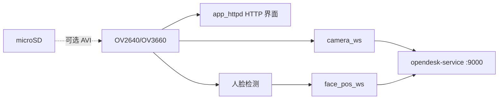

# Deskbot Camera

中文 | [English](README.md) · 仓库总览：[README_zh.md](../README_zh.md)

**Seeed XIAO ESP32S3 Sense** 摄像头固件：本地 HTTP 预览、JPEG 与人脸关键点 WebSocket 上行、可选 SD 卡 AVI 录制。与 [deskbot-rom](../deskbot-rom/README_zh.md) 主控配合使用。

## 配置与烧录

WiFi / 服务器 / device_id 均在仓库根 **`deskbot.local.env`**（`flash_camera.sh` 可交互补全 WiFi）。未配置 WiFi 时上电会开启热点 **`Deskbot_Camera`**，浏览器访问 `http://192.168.4.1/` 配网。

```bash
cd deskbot-camera
./flash_camera.sh all
```

| 命令 | 说明 |
|------|------|
| `./flash_camera.sh build` | 仅编译 |
| `./flash_camera.sh upload [端口]` | 烧录（常见 `/dev/ttyACM0`） |
| `./flash_camera.sh log [端口]` | 串口监视（115200） |
| `./flash_camera.sh all [端口]` | 烧录 + 监视 |

**上电后：** 串口打印 IP 与 `device_id=deskbot_<mac>`，浏览器访问 `http://<IP>/` 预览与控制。

未设置 `DESKBOT_WS_HOST` 时仍可 HTTP 预览与本地人脸检测，但不会连接 WebSocket 上行。

**设备 ID：** 由板载 MAC 自动生成 `deskbot_<mac>`；与主控同一块板则 ID 相同，**无需编译配置**。

## 架构



| 组件 | 职责 |
|------|------|
| `deskbot_camera.ino` | WiFi、摄像头初始化、任务启动 |
| `app_httpd.cpp` | HTTP 流与板载 Web UI |
| `camera_ws.*` | JPEG 二进制上行 |
| `face_pos_ws.*` | 人脸关键点 JSON 上行 |

详见 [docs/ARCHITECTURE.md](../docs/ARCHITECTURE.md)。

## 技术参数

| 项目 | 说明 |
|------|------|
| 开发板 | Seeed XIAO ESP32S3 Sense（摄像头 + PSRAM） |
| 传感器 | OV2640 / OV3660 |
| Flash | 8 MB，分区 `max_app_8MB` |
| PlatformIO 环境 | `seeed_xiao_esp32s3` |
| 串口 | 115200，USB-C |
| SD 卡 | 可选，CS = GPIO 21（AVI 录制） |
| 设备 ID | `deskbot_<mac>`（运行时由 WiFi MAC 生成） |

### WebSocket 上行

| 路径 | 载荷 |
|------|------|
| `/camera?device_id=deskbot_<mac>` | JPEG 二进制帧 |
| `/device_pipeline?role=pub&device_id=deskbot_<mac>` | JSON `{ device_id, points, confidence }` |

## 目录

```
deskbot-camera/
├── platformio.ini
├── firmware/
├── tools/             # fix_avi.py、vision_client.py（可选 PC 工具）
└── flash_camera.sh
```
