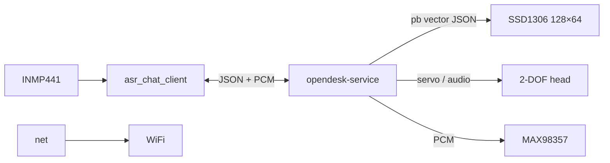

# Deskbot ROM

[中文](README_zh.md) | English · Repo root: [README.md](../README.md)

ESP32-S3 **main-controller** firmware: WiFi, voice dialog over WebSocket, server-driven OLED + head motion, mic capture and speaker playback.

## Configure & flash

Set **`deskbot.local.env`** at repo root (or enter WiFi when `flash_rom.sh` prompts; Enter to skip):

```bash
cd deskbot-rom
./flash_rom.sh all
```

| Script | Action |
|--------|--------|
| `./flash_rom.sh build` | Compile only |
| `./flash_rom.sh upload [port]` | Flash firmware |
| `./flash_rom.sh log [port]` | Serial monitor (115200) |
| `./flash_rom.sh all [port]` | Upload + monitor |

**WiFi priority:** saved `/WIFI.conf` → `wifi_defaults.h` → soft-AP **`Deskbot_Rom`** (captive portal).

**Voice:** `ws://<ASR_CHAT_HOST>:<port>/asr_chat?device_id=deskbot_<mac>`. Deploy [opendesk-service](https://github.com/OpenDeskBot/open-deskbot-service) on your server.

**Device ID:** auto `deskbot_<mac>` from board MAC (lowercase hex, no separators). Printed on serial at boot — no build-time config.

## Architecture



| Module | Role |
|--------|------|
| `net` | WiFi, captive portal, `/WIFI.conf`, UDP discovery |
| `asr_chat_client` | WebSocket uplink mic PCM, downlink pb + binary audio |
| `audio_capture` / `audio_player` | I2S mic in, I2S speaker out |
| `oled` | Server pb vector frame rendering |
| `head` / `act` | 2-DOF servos, motion queue |
| `cmd` | Serial JSON commands |
| `led` | WS2812 status |

Details: [docs/ARCHITECTURE.md](../docs/ARCHITECTURE.md).

## Technical specs

| Item | Value |
|------|-------|
| MCU | ESP32-S3 (`esp32-s3-devkitc-1`), PSRAM enabled |
| Firmware | v2.0.1, Arduino + PlatformIO env `esp32s3_v2_0_1` |
| Partition | `noota_ffat` (FFat for `/WIFI.conf`) |
| Serial | 115200 baud |
| Display | SSD1306 128×64, I2C `0x3C` |
| Mic | INMP441 (I2S) |
| Amp | MAX98357 (I2S) |
| Head | 2 servos — X: GPIO 12, Y: GPIO 13 |
| LED | WS2812, GPIO 48 |
| Device ID | `deskbot_<mac>` (runtime, from WiFi MAC) |

## Layout

```
deskbot-rom/
├── platformio.ini
├── firmware/          # src_dir
└── flash_rom.sh
```
