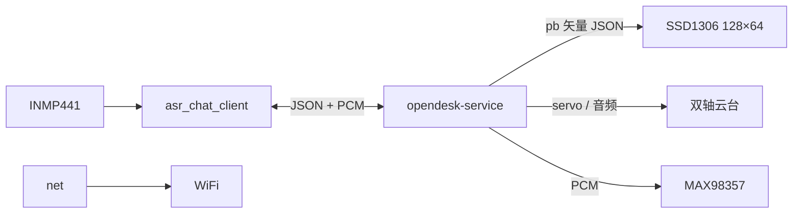

# Deskbot ROM

中文 | [English](README.md) · 仓库总览：[README_zh.md](../README_zh.md)

ESP32-S3 **主控**固件：WiFi 配网、WebSocket 语音对话、服务端驱动 OLED 与云台、麦克风采集与扬声器播放。

## 配置与烧录

在仓库根目录 **`deskbot.local.env`** 中统一配置（或 `./flash_rom.sh` 时按提示输入 WiFi，回车可跳过）：

```bash
cd deskbot-rom
./flash_rom.sh all
```

| 命令 | 说明 |
|------|------|
| `./flash_rom.sh build` | 仅编译 |
| `./flash_rom.sh upload [端口]` | 烧录 |
| `./flash_rom.sh log [端口]` | 串口监视（115200） |
| `./flash_rom.sh all [端口]` | 烧录 + 监视 |

**WiFi 优先级：** 已保存 `/WIFI.conf` → `wifi_defaults.h` → 热点 **`Deskbot_Rom`**（Captive Portal）。

**语音：** `ws://<ASR_CHAT_HOST>:<端口>/asr_chat?device_id=deskbot_<mac>`。服务端部署 [opendesk-service](https://github.com/OpenDeskBot/open-deskbot-service)。

**设备 ID：** 由板载 MAC 自动生成 `deskbot_<mac>`（小写 hex、无分隔符），上电串口可查看，**无需编译配置**。

## 架构



| 模块 | 职责 |
|------|------|
| `net` | WiFi、配网门户、`/WIFI.conf`、UDP 发现 |
| `asr_chat_client` | WebSocket 上行麦克风 PCM，下行 pb + 二进制音频 |
| `audio_capture` / `audio_player` | I2S 采集与播放 |
| `oled` | 服务端 pb 矢量帧渲染 |
| `head` / `act` | 双舵机与动作队列 |
| `cmd` | 串口 JSON 指令 |
| `led` | WS2812 状态灯 |

详见 [docs/ARCHITECTURE.md](../docs/ARCHITECTURE.md)。

## 技术参数

| 项目 | 说明 |
|------|------|
| MCU | ESP32-S3（`esp32-s3-devkitc-1`），启用 PSRAM |
| 固件 | v2.0.1，Arduino + PlatformIO 环境 `esp32s3_v2_0_1` |
| 分区 | `noota_ffat`（FFat 存 `/WIFI.conf`） |
| 串口 | 115200 |
| 屏幕 | SSD1306 128×64，I2C `0x3C` |
| 麦克风 | INMP441（I2S） |
| 功放 | MAX98357（I2S） |
| 云台 | 双舵机 — X: GPIO 12，Y: GPIO 13 |
| 灯带 | WS2812，GPIO 48 |
| 设备 ID | `deskbot_<mac>`（运行时由 WiFi MAC 生成） |

## 目录

```
deskbot-rom/
├── platformio.ini
├── firmware/          # src_dir
└── flash_rom.sh
```
