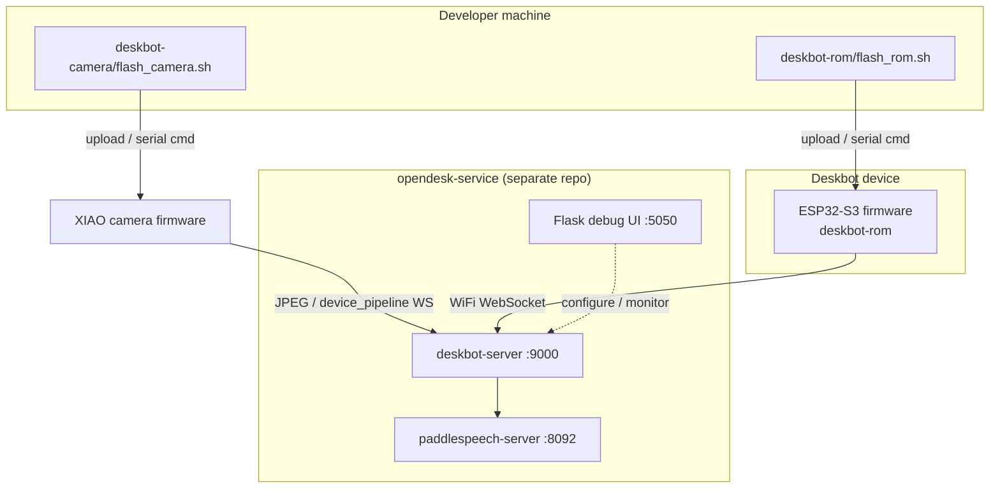

# Architecture

## System context

## Firmware modules (`deskbot-rom/firmware/`)

| Module | Responsibility |
|--------|----------------|
| `net` | WiFi AP captive portal, UDP discovery, `/WIFI.conf` persistence |
| `asr_chat_client` | WebSocket client, uplink mic PCM, downlink pb + binary audio |
| `audio_capture` / `audio_player` | INMP441 capture, I2S playback, stream queue |
| `oled` | SSD1306 渲染任务、服务端 pb 矢量帧 JSON 插值绘制 |
| `head` / `act` | 2-DOF servos, async motion queue |
| `cmd` | Serial JSON command dispatch |
| `led` | WS2812 status |

Build-time configuration:

- `ASR_CHAT_HOST` / `ASR_CHAT_PORT` — voice backend (from repo-root `deskbot.local.env` → `DESKBOT_WS_HOST` / `DESKBOT_WS_PORT`, injected at flash)
- `wifi_defaults.h` — generated from `deskbot.local.env` at flash time; empty SSID → ROM captive portal
- `device_id` — shared `DEVICE_ID` in `deskbot.local.env`; injected at flash (`scripts/deskbot_flash_config.sh`)

## Host tools (this repo)

| Component | Role |
|-----------|------|
| `deskbot-rom/flash_rom.sh` | ROM `build` / `upload` / `log` / `all` |
| `deskbot-camera/flash_camera.sh` | Camera module flash + serial log |

Serial JSON commands (`cmd.cpp`) can still be sent with any serial terminal; device debugging UI lives in **opendesk-service**.

## Protocol boundaries

1. **Serial (host ↔ firmware)** — JSON lines consumed by `cmd.cpp`.
2. **WebSocket (firmware ↔ asr_chat)** — JSON control + binary PCM; see `asr_chat_client.h`.
3. **WiFi config** — HTTP form on soft-AP; secrets in `wifi_defaults.h` / `/WIFI.conf` only.

## Test firmware

Removed. Use production `deskbot-rom/` firmware for hardware validation.

## Related docs

- [pb-vector-oled-interpolation-web.md](../deskbot-rom/doc/pb-vector-oled-interpolation-web.md)
- [CONTRIBUTING.md](../CONTRIBUTING.md)
